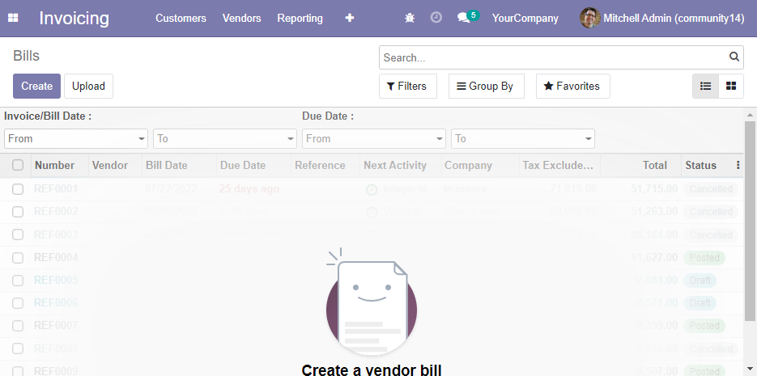

.. image:: https://img.shields.io/badge/license-AGPL--3-blue.png
   :target: https://www.gnu.org/licenses/agpl
   :alt: License: AGPL-3

=====================
Tree View Date Search
=====================

This module allow you to easily add date range search fields to tree views.
These date fields can be used in combination with the Search window.

Usage
=====

General Idea
~~~~~~~~~~~~

Add a new 'dates_filter' key and a list of field names in the action context,
e.g Vendor Bills (action 'account.action_move_in_invoice_type')

.. code:: python

  'dates_filter': ['invoice_date', 'invoice_date_due']

*Invisible fields and not searchable fields are ignored*

ir.config_parameter
~~~~~~~~~~~~~~~~~~~

``web_tree_date_search.applicability`` *string* (Default: ``selective``)

    Two possibilities :
        1. ``all`` - It shows the date filters for all date/datetime fields in any tree view.
        2. ``selective`` - It shows the date filters based on the context of the tree view action.

In any case, the fields list can be overridden by adding a dates_filter context in the tree view action.

ir.actions.act_window context
~~~~~~~~~~~~~~~~~~~~~~~~~~~~~

* ``'dates_filter'``:*boolean* - It shows/hides the date filters for all date/datetime fields of the tree view action.
* ``'dates_filter'``:*list* - It shows the date filters for the fields defined.

Possible cases (Examples)
~~~~~~~~~~~~~~~~~~~~~~~~~

    1. I set the applicability on ``all`` and I want to disable the date filters for a specific action::

        <record id="account.action_move_in_invoice_type" model="ir.actions.act_window">
            <field name="context">{'dates_filter': False}</field>
        </record>

    2. I set the applicability on ``all`` and I want to override the field list for the date filters::

        <record id="account.action_move_in_invoice_type" model="ir.actions.act_window">
            <field name="context">{'dates_filter': ["invoice_date"]}</field>
        </record>

    3. I set the applicability on ``selective`` and I want to enable the date filters for a specific action without the need to define all fields::

        <record id="account.action_move_in_invoice_type" model="ir.actions.act_window">
            <field name="context">{'dates_filter': True}</field>
        </record>

    4. I set the applicability on ``selective`` and I want to enable the date filters for a specific window and define all fields shown::

        <record id="account.action_move_in_invoice_type" model="ir.actions.act_window">
            <field name="context">{'dates_filter': ['invoice_date', 'invoice_date_due']}</field>
        </record>

